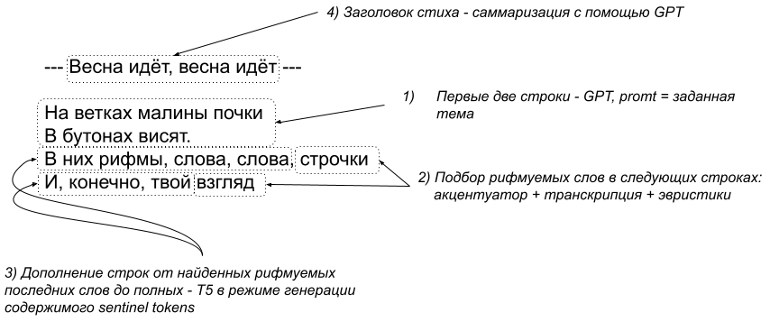

# Генерация стихов с помощью больших языковых моделей


Репозиторий содержит код инференса для генерации коротких стихов.


## Генерация трехстрочников ("хайку")

Доступен докер-образ для запуска генератора как телеграм-бота: [скачать отсюда](https://disk.yandex.ru/d/pfP_x6xSe0jwlw).

Загружаем образ и запускаем:

```
sudo docker run -it haiku:latest
```

Программа попросит ввести токен телеграм-бота. Затем загрузятся модели (примерно минута) и можно 
общаться с ботом. Вводите затравку - существительное или словосочетание. Генерация нескольких вариантов
на CPU идет примерно 30 секунд. Затем бот выведет первый вариант и предложит оценить его,
либо вывести следующий вариант.


## Генерация четырехстрочников





Подробное описание всего пайплайна можно [прочитать тут](https://kelijah.livejournal.com/288594.html).

Бинарные файлы моделей из-за своего большого размера не выложены, но доступны
в докер-образе.

Докер-образ размером около 6.4Гб можно [скачать отсюда](https://disk.yandex.ru/d/T6gRpDTTDAAoig).

Запускаем образ:

```
sudo docker run -it verslibre:latest
```

После загрузки всех моделей в консоли появится приглашение ввести тему для генерации. Темой может быть любое
словосочетание с существительным в главной роли, например "генератор стихов".

Результаты генерации будут печататься прямо в консоль. Фрагменты с заголовком "VERS-LIBRE" являются нерифмованной выдачей GPT. А фрагменты с заголовком "POEM" 
содержат результат работы полного пайплайна, показанного на диаграмме.

Примеры генерации:

```
--- Прохладный ветерок ---

Прохладный ветерок,
Трепет и прохлада.
Я, как и прежде, не смог
Помолиться, глядя


--- А дождь проливал проливной ---

А дождь проливал проливной,
В окна дома глядел.
И я, как будто, был счастлив с тобой
И чего-то, чего-то хотел
```

## Обучающие данные

В подкаталоге [tmp](https://github.com/Koziev/verslibre/tmp) лежат файлы с частью обучающих данных:

[poetry_corpus.txt](https://github.com/Koziev/verslibre/tmp/poetry_corpus.txt) - корпус отфильтрованных четверостиший, символ | в качестве разделителя строк; используется для дотренировки модели ruT5.  
[poem_generator_dataset.dat](https://github.com/Koziev/verslibre/tmp/poem_generator_dataset.dat) - датасет для тренировки ruGPT, выдающей текст стиха по теме (ключевому словосочетанию).  
[captions_generator_rugpt.dat](https://github.com/Koziev/verslibre/tmp/captions_generator_rugpt.dat) - датасет для тренировки ruGPT, генерирующей заголовок стиха по его содержимому.  

Описание процесса подготовки обучающего корпуса можно [найти здесь](https://kelijah.livejournal.com/288594.html).


