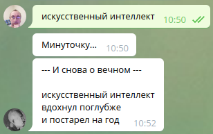

# Генерация стихов с помощью больших языковых моделей


Репозиторий содержит код для создания коротких стихов с помощью генеративных языковых моделей с архитектурой GPT.


## Силлабо-тоническая языковая модель для генерации четырехстрочников 

Используется трансформенная языковая модель на основе архитектуры GPT. Эта модель учитывает как грамматику русского языка (подобно
языковым моделям типа rugpt), так и его фонетику, включая правила рифмования и построения стихотворного метра. Подробности есть
в [презентации](https://github.com/Koziev/verslibre/blob/stressed_gpt/%D0%A1%D0%B8%D0%BB%D0%BB%D0%B0%D0%B1%D0%BE-%D1%82%D0%BE%D0%BD%D0%B8%D1%87%D0%B5%D1%81%D0%BA%D0%B0%D1%8F%20%D1%8F%D0%B7%D1%8B%D0%BA%D0%BE%D0%B2%D0%B0%D1%8F%20%D0%BC%D0%BE%D0%B4%D0%B5%D0%BB%D1%8C%20%D0%B4%D0%BB%D1%8F%20%D0%B3%D0%B5%D0%BD%D0%B5%D1%80%D0%B0%D1%86%D0%B8%D0%B8%20%D1%81%D1%82%D0%B8%D1%85%D0%BE%D0%B2.pdf).


Бинарные файлы моделей доступны в докер-образе [inkoziev/verslibre:latest](https://hub.docker.com/repository/docker/inkoziev/verslibre).

Скачиваем и запускаем образ:

```
sudo docker pull inkoziev/verslibre:latest
sudo docker run -it inkoziev/verslibre:latest
```

После запуска программа запросит ввод токена для телеграм-бота.

После загрузки всех моделей можно запустить бота в его чате командой /start. Бот предложит выбрать одну из трех
случайных тем для сочинения либо ввести свою тему. Темой может быть любое
словосочетание с существительным в главной роли, например "генератор стихов".

Этот бот доступен в телеграмме как [@verslibre_bot](http://t.me/verslibre_bot)

Примеры генерации:

```
       * * *
Любовь - источник вдохновения,
Души непризнанных людей.
И день весеннего цветения,
Омытый зеленью дождей…

       * * *
Душа, гонимая страстями,
Тревожит, веет теплотой.
Любовь, хранимая стихами,
И примиренье, и покой.
```


Кроме самой генеративной модели, большое значение для правильной работы имеет поэтический транскриптор, который
размечает исходные стихи для обучения моделей. Подробнее о работе транскриптора можно почитать [тут](https://kelijah.livejournal.com/294572.html).


## Генерация трехстрочников ("хайку")



Доступен докер-образ [inkoziev/haiku:latest](https://hub.docker.com/repository/docker/inkoziev/haiku) для запуска генератора как телеграм-бота.

Загружаем образ и запускаем:

```
sudo docker pull inkoziev/haiku:latest
sudo docker run -it inkoziev/haiku
```

Программа попросит ввести токен телеграм-бота. Затем загрузятся модели (примерно минута) и можно 
общаться с ботом. Вводите затравку - существительное или словосочетание. Генерация нескольких вариантов
на CPU идет примерно 30 секунд. Затем бот выведет первый вариант и предложит оценить его,
либо вывести следующий вариант.

Этот бот доступен в телеграмме как [@haiku_guru_bot](http://t.me/haiku_guru_bot).

Так как это рандомизированная генеративная модель, результаты ее работы обычно невозможно повторить простым вводом
такой же затравки. Копируйте хорошие результаты, дополняйте их иллюстративной моделью, например ruDALLE, и получайне уникальный
контент:


Больше примеров хайку можно увидеть [в моем блоге](https://kelijah.livejournal.com/293532.html).


## Обучающие данные

В подкаталоге [tmp](https://github.com/Koziev/verslibre/tmp) лежат файлы с частью обучающих данных:

[poetry_corpus.txt](https://github.com/Koziev/verslibre/tmp/poetry_corpus.txt) - корпус отфильтрованных четверостиший, символ | в качестве разделителя строк; используется для дотренировки модели ruGPT.  
[poem_generator_dataset.dat](https://github.com/Koziev/verslibre/tmp/poem_generator_dataset.dat) - датасет для тренировки ruGPT, выдающей текст стиха по теме (ключевому словосочетанию).  
[captions_generator_rugpt.dat](https://github.com/Koziev/verslibre/tmp/captions_generator_rugpt.dat) - датасет для тренировки ruGPT, генерирующей заголовок стиха по его содержимому.  

Описание процесса подготовки обучающего корпуса можно [найти здесь](https://kelijah.livejournal.com/288594.html).


